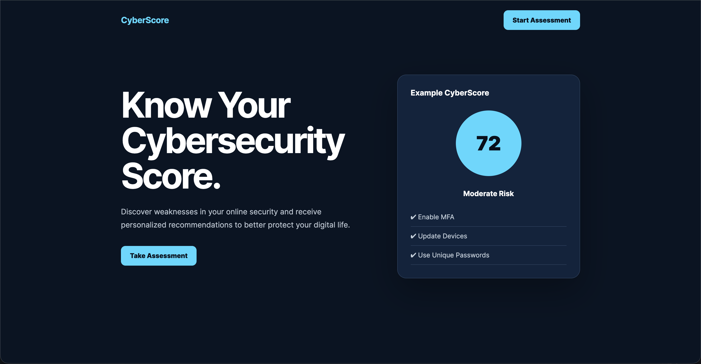
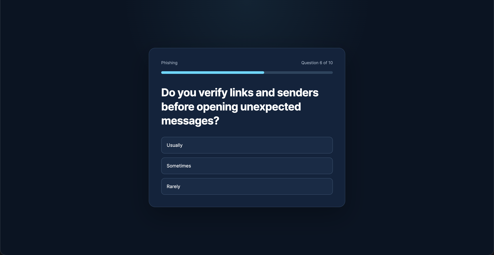
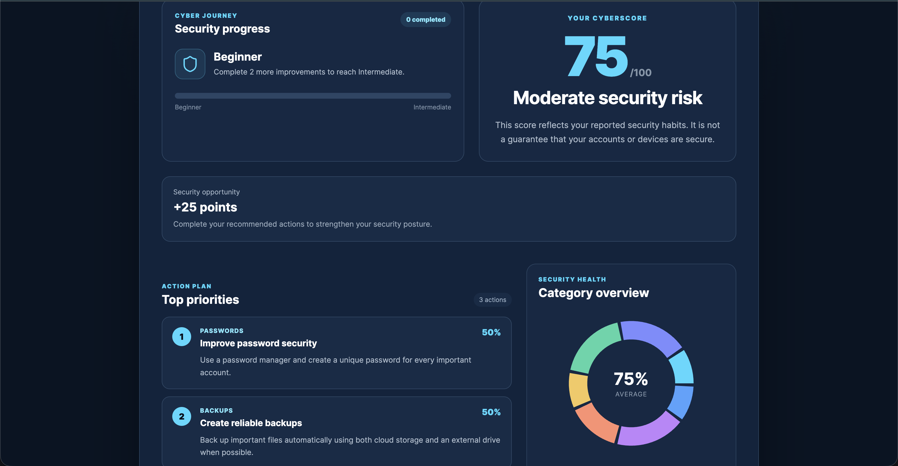
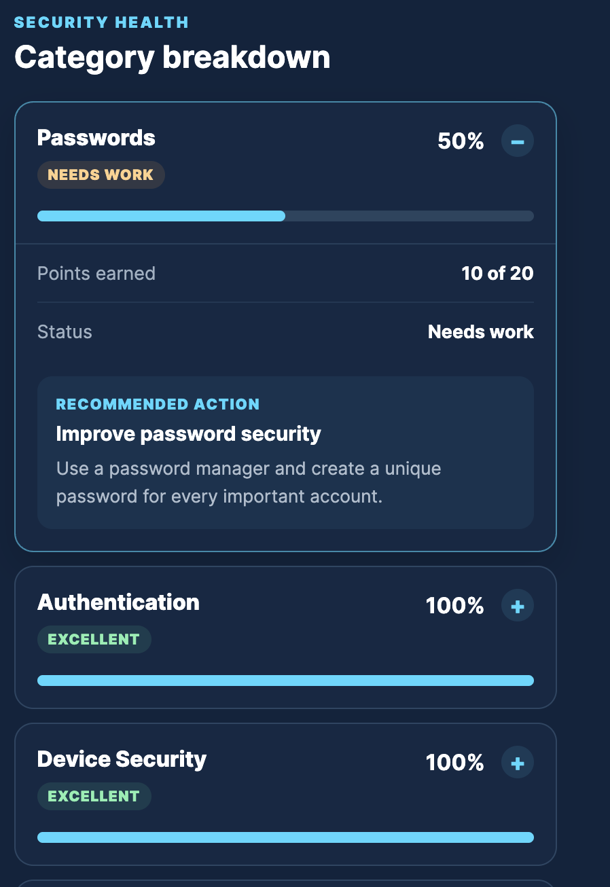
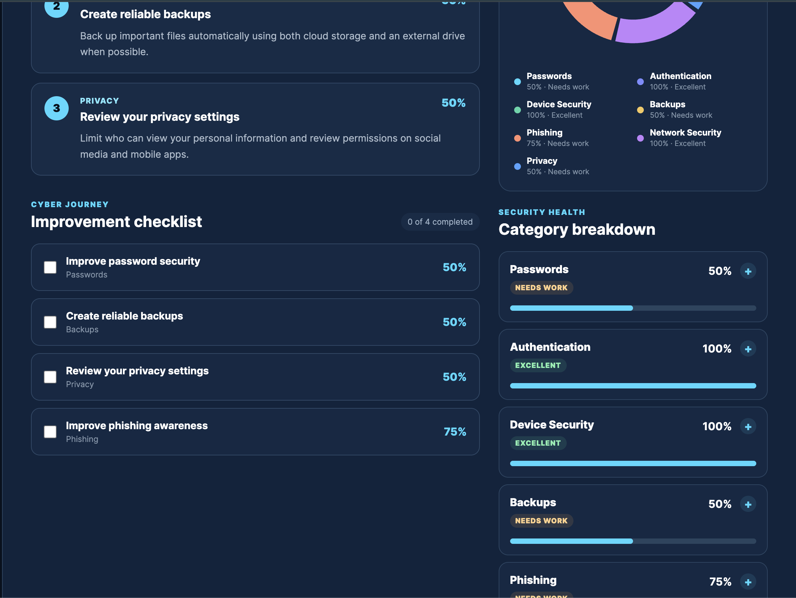

<h1 align="center">🛡️ CyberScore</h1>

<p align="center">
An interactive cybersecurity assessment platform that helps users evaluate their digital security habits, receive a personalized CyberScore, and follow a guided improvement roadmap.
</p>

<p align="center">
Built with React • TypeScript • Vite
</p>

---

# Overview

CyberScore is an educational web application designed to make cybersecurity approachable for everyday users.

Instead of overwhelming users with technical jargon, CyberScore asks a series of simple questions about password management, authentication, phishing awareness, backups, device security, privacy, and network security.

After completing the assessment, users receive:

- A personalized CyberScore (0–100)
- Overall security risk level
- Category-by-category security analysis
- Actionable improvement recommendations
- A security progression system ("Cyber Journey")
- Interactive checklist to track completed improvements
- Visual security dashboard with charts and progress indicators

The goal is to turn cybersecurity education into something interactive, measurable, and motivating.

---

## Landing Page



## Assessment



## Results Dashboard



## Category Breakdown



## Improvement Checklist



# Features

## Assessment Engine

- Multi-category cybersecurity questionnaire
- Weighted scoring system
- Category-specific score tracking
- Overall CyberScore calculation

## Interactive Dashboard

- Personalized CyberScore
- Risk classification
- Security opportunity summary
- Category health overview
- Interactive category chart
- Expandable category breakdown

## Personalized Recommendations

Recommendations automatically prioritize the user's weakest security areas.

Examples include:

- Enable Multi-Factor Authentication
- Improve Password Security
- Create Reliable Backups
- Strengthen Device Protection
- Improve Phishing Awareness
- Secure Home Network
- Review Privacy Settings

---

## Cyber Journey

Users progress through security levels as they complete improvements.

Current progression:

- 🟦 Beginner
- 🟩 Intermediate
- 🟨 Advanced
- 🟪 Expert *(planned)*

The dashboard displays:

- Current security level
- Improvements completed
- Progress bar
- Remaining actions needed for the next level

---

## Improvement Checklist

Every recommendation can be tracked through an interactive checklist.

Features include:

- Completion tracking
- Progress counter
- Persistent improvement roadmap *(planned)*
- Personalized learning path

---

## Category Analysis

CyberScore evaluates:

- Password Security
- Authentication
- Device Security
- Backups
- Phishing Awareness
- Network Security
- Privacy

Each category displays:

- Percentage score
- Status badge
- Progress bar
- Recommended action

---

# Built With

- React
- TypeScript
- Vite
- CSS
- Lucide React Icons
- Recharts

---

# Project Structure

```
src/
│
├── assets/
├── components/
│   ├── Hero
│   ├── QuestionCard
│   ├── ResultsDashboard
│   ├── CyberJourney
│   └── CategoryChart
│
├── data/
│   ├── questions
│   └── recommendations
│
├── utils/
│   ├── dashboard
│   ├── journey
│   └── levels
│
├── App.tsx
└── main.tsx
```

---

# Roadmap

## Phase 1 — Core Assessment Experience

- [x] Landing page
- [x] Assessment flow
- [x] Question navigation
- [x] Weighted scoring
- [x] Results dashboard
- [x] Category scoring
- [x] Interactive recommendations
- [x] Cyber Journey progression
- [x] Improvement checklist
- [x] Category visualization
- [x] Responsive dashboard
- [x] Dashboard animations and live category recalculation

---

## Phase 2A — Authentication Foundation

- [x] Supabase client setup
- [x] Session initialization and auth state listener
- [x] Google OAuth frontend integration
- [x] Optional sign-in from assessment results
- [x] Sign-out flow
- [x] Visible authentication loading and configuration errors

---

## Phase 2B — OAuth Provider Configuration

- [ ] Configure Google OAuth provider
- [ ] Implement Microsoft/Azure OAuth frontend integration
- [ ] Configure Microsoft/Azure OAuth provider
- [ ] Add local and production redirect URLs
- [ ] Test sign-in, sign-out, and restored sessions
- [ ] Test canceled and failed OAuth attempts

Assessment persistence, database tables, and Row Level Security are planned for later Phase 2 work.

---

## Phase 3 — AI Features

- [ ] AI security assistant
- [ ] Personalized explanations
- [ ] Security chatbot
- [ ] AI-generated recommendations
- [ ] Threat education

---

## Phase 4 — Enterprise

- [ ] Organization dashboards
- [ ] Team security scores
- [ ] Administrator portal
- [ ] Reporting
- [ ] Analytics

---

# Installation

Clone the repository

```bash
git clone https://github.com/amanmssd/CyberScore.git
```

Navigate into the project

```bash
cd CyberScore
```

Install dependencies

```bash
npm install
```

Run the development server

```bash
npm run dev
```

Build for production

```bash
npm run build
```

---

# Future Vision

CyberScore is intended to grow beyond a simple assessment into a complete cybersecurity education platform.

Planned capabilities include:

- Account creation
- Progress tracking
- Historical score comparisons
- AI-powered coaching
- Personalized learning paths
- Enterprise security dashboards
- Gamification and achievements

---

# Author

**Aman Masood**

Cybersecurity Student at Penn State University

Experienced in:
- Cybersecurity
- Software Engineering
- Application Development
- Artificial Intelligence
- Full-Stack Development

GitHub:
https://github.com/amanmssd

---

# License

This project is licensed under the MIT License.
